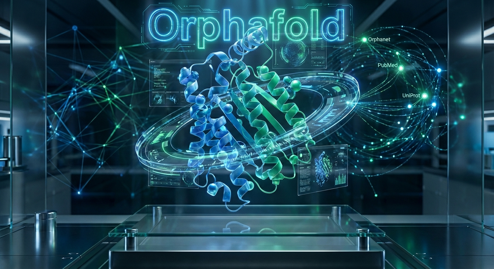
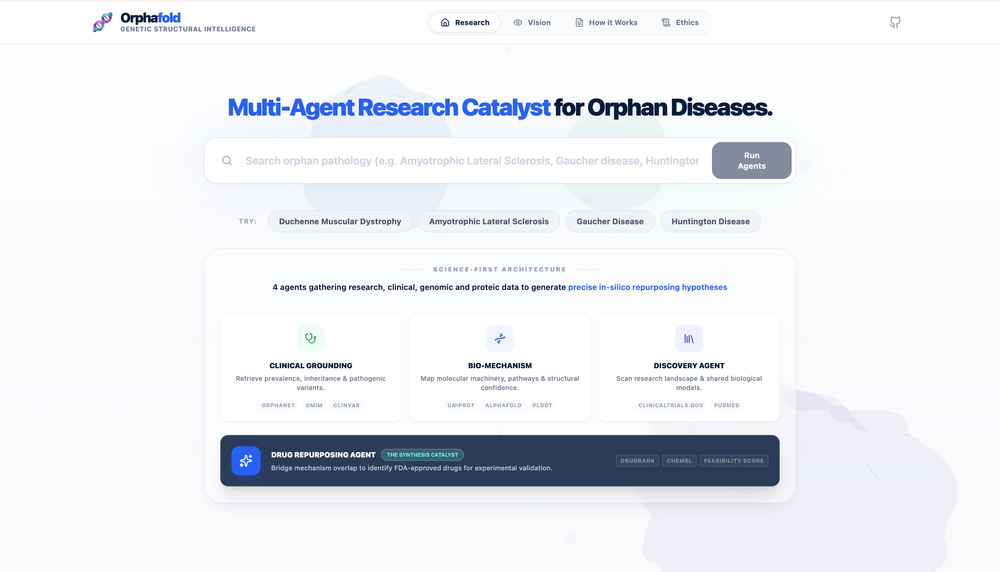
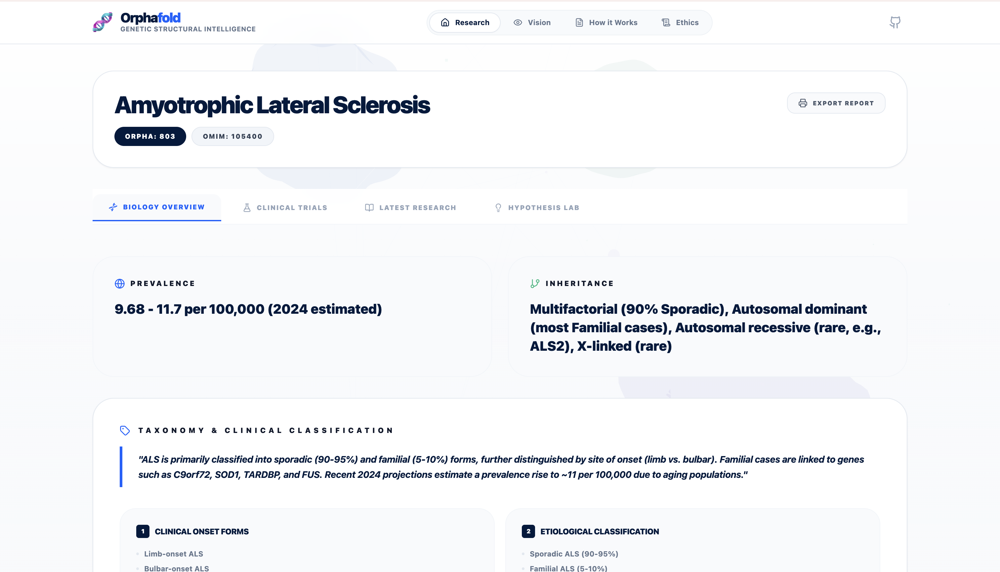
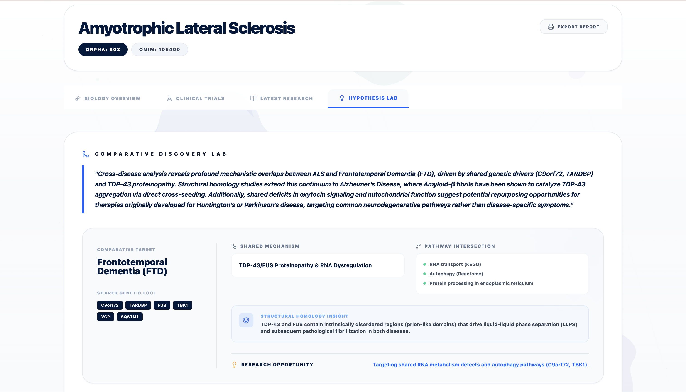
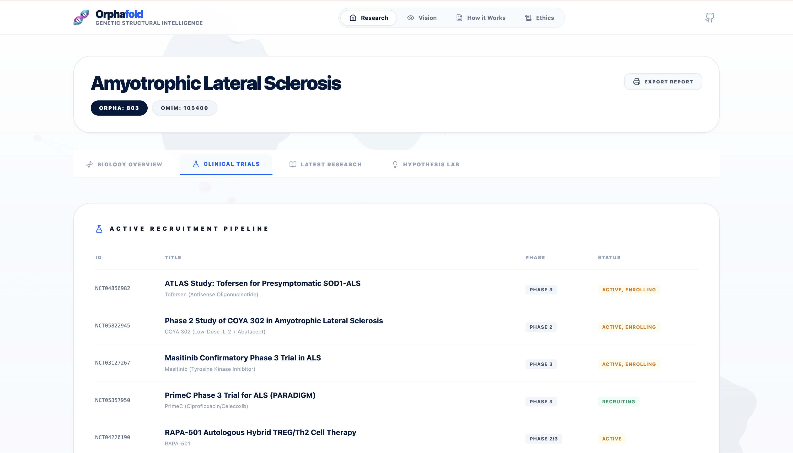
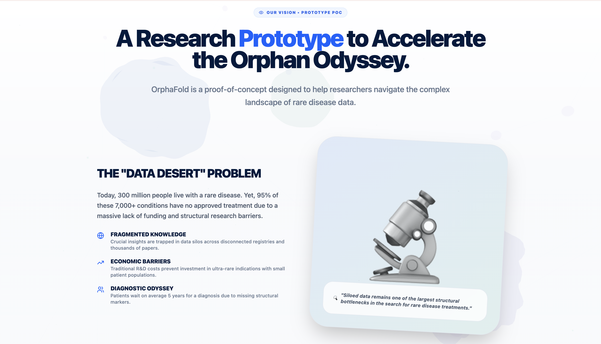
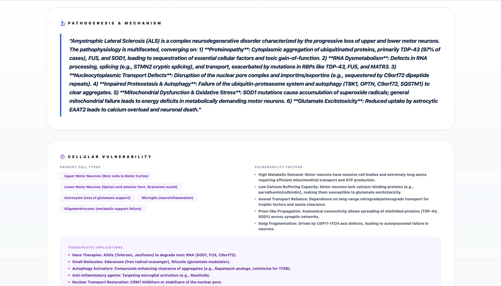
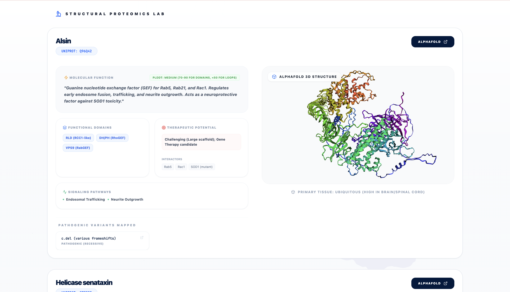
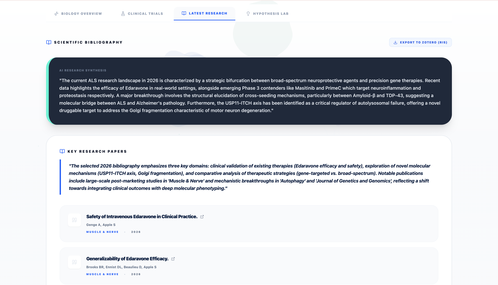

<div align="center">



# 🧬 OrphaFold

**AI-powered research platform for rare diseases**

Multi-agent architecture • Biomedical APIs • Comprehensive reports

[](https://deepmind.google/technologies/gemini/)
[](https://www.typescriptlang.org/)
[](https://react.dev/)
[](https://alphafold.ebi.ac.uk/)
[](https://www.orpha.net/)
[](https://pubmed.ncbi.nlm.nih.gov/)
[](https://www.ncbi.nlm.nih.gov/clinvar/)

[Quick Start](#-installation) • [Architecture](documentation/architecture.md) • [Devpost Submission](Devpost.md)

</div>


# OrphaFold: Deep Structural Search for Orphan Diseases

> [!NOTE]
> OrphaFold is a **Research Prototype and Proof of Concept (PoC)**. It is intended for professional researchers and geneticists as a decision-support tool, not as a clinical system.

OrphaFold is an AI-powered platform designed to accelerate research into orphan diseases by combining real-time API enrichment with advanced Multi-Agent orchestration and structural biology.

## 👁️ The "Why" (Vision)

Today, 300 million people live with a rare disease. Yet, **95% of these 7,000+ conditions have no approved treatment**. This is largely driven by a chronic lack of funding, economic barriers, and fragmented knowledge trapped in silos.

OrphaFold serves as a **technical demonstrator** to bridge this gap through **Structural Intelligence**:
- **Accelerating Synthesis**: Compressing literature review by orchestrating specialized agents.
- **Mechanics-First**: Using protein structures (AlphaFold) as a key baseline for discovery.
- **Democratizing Repurposing**: Identifying hidden connections between existing drugs and rare proteins.

## 📸 Interface Preview

<div align="center">

| 🏠 Search & Home | 🧪 Biological Insights |
|:---:|:---:|
|  |  |
| **💊 Hypothesis Lab** | **🔬 Research Tracking** |
|  |  |
| **👁️ Project Vision** | **🧬 Structural Analysis** |
|  |  |
| **🧪 Cross-Disease Insights** | **� Structural Proteomics (AlphaFold)** |
|  |  |
| **📚 Bibliography Management** | |
|  | |

</div>

## 🧬 The Agent Architecture

OrphaFold orchestrates a 4-agent pipeline to analyze orphan pathologies from multiple biological perspectives:

### 1. 🏥 Clinical Grounding Agent
*   **Purpose:** Establishes the clinical baseline using direct REST APIs.
*   **APIs & Tools:** Orphanet (orphadata.com), OMIM (NCBI E-utilities), Google Search Grounding.
*   **Output:** Prevalence, inheritance patterns, and disease classifications.

### 2. 🧪 Bio-Mechanism Agent
*   **Purpose:** Uncovers the molecular pathophysiology and structural machinery.
*   **APIs & Tools:** UniProt, NCBI Gene, ClinVar, AlphaFold DB (3D Viewer).
*   **Output:** Target proteins, functional domains, pLDDT confidence, and druggability assessments.

### 3. 🔬 Discovery Agent
*   **Purpose:** Connects the disease to the broader research and clinical landscape.
*   **APIs & Tools:** PubMed (NCBI), ClinicalTrials.gov, structural homology search.
*   **Output:** Active trials, synthesized bibliography, and cross-disease insights.

### 4. 💊 Drug Repurposing Agent (The Synthesis Catalyst)
*   **Purpose:** Proposes therapeutic candidates by bridging mechanism overlap (On-Demand).
*   **APIs & Tools:** DrugBank, ChEMBL, Reasoning Engine (thinking budget).
*   **Output:** In-silico repurposing hypotheses with feasibility scores and validation steps.

---

## 🚀 How it Works

1.  **Input:** The user enters a rare disease name or description (e.g., "Cystic Fibrosis").
2.  **API Enrichment:** The system acts as a "Pre-Flight" layer, simultaneously querying:
    *   *Orphanet, OMIM, UniProt, NCBI Gene, ClinVar, PubMed.*
3.  **Agent Orchestration:** The gathered context is fed into the Multi-Agent System powered by **Gemini 1.5 Pro**.
4.  **Synthesis:** The agents reason over the data, perform additional Google Searches for missing info, and generate a structured report.
5.  **Visualization:** The frontend renders interactive molecular structures (pdb), clinical data cards, and research timelines.

---

## 💻 Installation

**Prerequisites:** Node.js (v18+)

1.  **Clone the repository:**
    ```bash
    git clone https://github.com/Paulhb7/orphafold.git
    cd orphafold
    ```

2.  **Install dependencies:**
    ```bash
    make install
    # OR
    npm install
    ```

3.  **Configure Environment:**
    *   Create a `.env.local` file in the root directory.
    *   Add your Gemini API Key:
        ```env
        GEMINI_API_KEY=your_api_key_here
        ```

4.  **Run Locally:**
    ```bash
    make dev
    # OR
    npm run dev
    ```

## 🌍 Deployment

This project is optimized for deployment on **Google AI Studio**.
