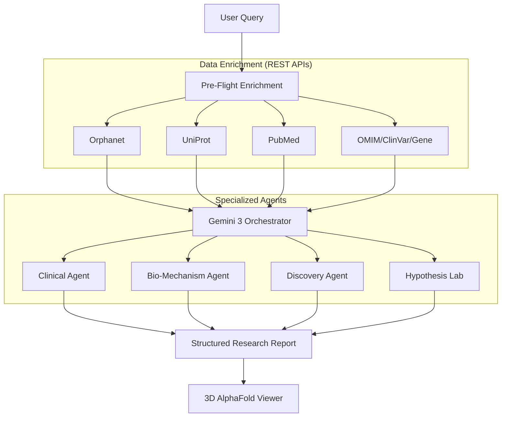

# OrphaFold Architecture: Multi-Agent Structural Intelligence

OrphaFold utilizes an agentic orchestration pipeline designed to bridge the gap between clinical data, literature research, and structural proteomics.

## 🏗️ System Overview

The system architecture is divided into three distinct layers:
1. **Pre-Flight Enrichment Layer** (Data Grounding)
2. **Logic Engine** (Gemini 3 Orchestration)
3. **Execution Layer** (Specialized Agents)

---

## 🛡️ 1. Pre-Flight Enrichment Layer
Before any AI reasoning occurs, the system performs a "Pre-Flight" sweep across trusted biomedical databases. This creates a **Grounded Context** that eliminates hallucinations.
- **Orphanet/OMIM**: For disease classification and validated medical IDs.
- **UniProt/NCBI Gene**: For mapping target proteins and genomic coordinates.
- **ClinVar**: For identifying pathogenic variants.
- **PubMed**: For retrieving the most recent clinical literature.

## 🧠 2. Gemini 3 Logic Engine
We utilize **Gemini 3** with a large context window and **Thinking Config (Thinking Budget)**. This allows the model to:
- Perform long-range reasoning over complex biological pathways.
- Use **Grounding with Google Search** to fill gaps in API data (e.g., very recent clinical trials).
- Maintain state across multiple specialized agents.

## 👥 3. The 4 Specialized Agents

### 🏥 Clinical Grounding Agent
Maps the epidemiological landscape. It synthesizes prevalence, inheritance patterns, and the hierarchical classification of the disease.

### 🧪 Bio-Mechanism Agent
The "structural brain" of the system. It connects the disease to UniProt entries and retrieves **AlphaFold 3D protein structures** from AlphaFold DB API. It analyzes molecular functions, functional domains (Pfam/InterPro), and signaling pathways.

### 🔬 Discovery Agent
Scans the research landscape. It synthesizes literature reviews and maps active recruitment pipelines from ClinicalTrials.gov. It also handles **Cross-Disease Insights**, identifying shared mechanisms between rare and common pathologies.

### 💊 Hypothesis Lab (Repurposing Agent)
The synthesis catalyst. It uses structural homology analysis to identify existing drugs that target shared protein mechanisms, providing a feasibility score and a rationale for in-silico validation.

---

## ⚡ Structural Integration
The frontend integrates with the **AlphaFold DB API**, allowing the AI to direct the user to specific protein visualizations curated by the Bio-Mechanism agent.
